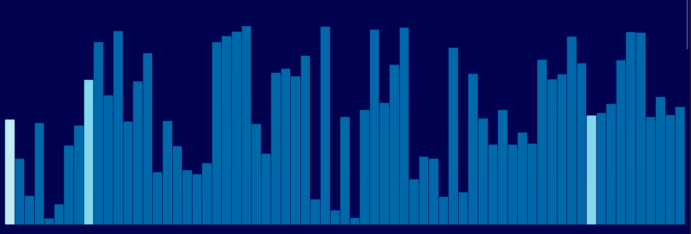

    
# Sorting Visualizer

A web app to visualize classic sorting algorithms such as insertion sort, quick sort,bubble sort and selection sort.

## Demo

Live Link : https://sortingvisualizers.netlify.app/

## Features

**1. Random Array Bars:**
- Generate random visual elements for testing.

**2. Adjustable Bar Size:**
- Dynamically change the size of array bars.

**3. Sorting Algorithms:**
- Implement and visualize Bubble, Selection, Insertion, and Quick Sort.

**4. Cross-Platform:**
- Works seamlessly across different operating systems.
  
## Screenshots

  
  
  

## Tech Stack

  
## Authors

- [@Kailash_Rampariya](https://github.com/kailash0611)
 

  
## Acknowledgements

 - [Async](https://developer.mozilla.org/en-US/docs/Web/JavaScript/Reference/Statements/async_function)
 - [Await](https://developer.mozilla.org/en-US/docs/Web/JavaScript/Reference/Operators/await)

  
  
 

